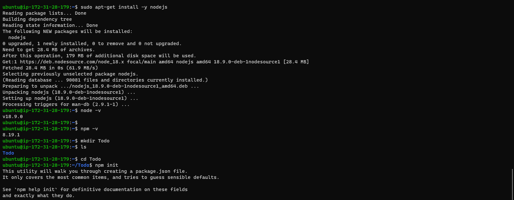

`sudo apt install`

`sudo apt update`

`sudo apt upgrade`
> got the location of Node.js
`curl -fsSL https://deb.nodesource.com/setup_18.x | sudo -E bash - ` 

`sudo apt-get install -y nodejs`

`node -v`
`npm -v`
`mkdir Todo`

- to use expressjs
`npm install express`
`touch index.js` 
`npm install dotenv`
`vim index.js`

- check through the port 5000 if running

- I had to check through my output using the .port5000 to see it is running

- moving forward I created models, first I had to change directory back to TODO folder `npm install mongoose` then create the model folder `mkdir models` after that had to change directory back to model `cd models` and then creating the file `touch todo.js`

# MERN STACK IMPLEMENTATION
- First I allowed access to MongoDB database, But first We will install the Mongoose software by running   `npm install `mongoose Then create a new directory with `mkdir models` the change directory to models inside which we create a file with touch `todo.js` 

- Run node  index.js 

- react app was created as well as a dependency concurrent

- Package.json (In the client directory) was configured and completely modified. After creating the src and components directory each with files and respective codes, Axios was installed with this command on the terminal `npm install axios` With multiple modifications to the sub files in src and components directory, the Todo app was fuctional and accesssed on the internet using the public IP on port 3000 with the final command `npm run dev`
